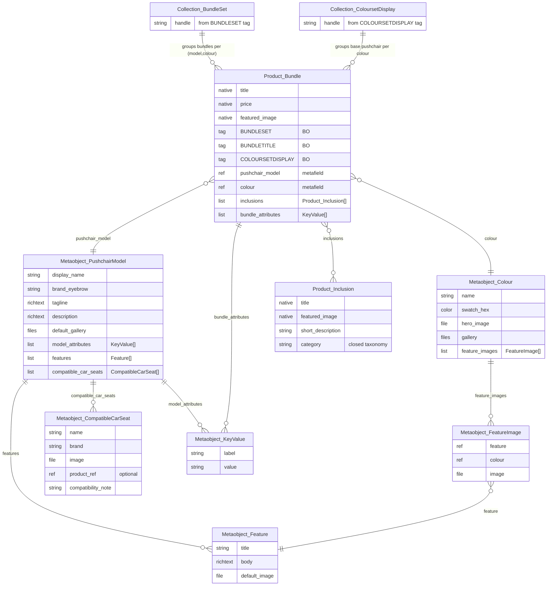

# Mamas & Papas — Travel PDP Project

**Onboarding for Becky · May 2026**

Welcome. This doc brings you up to speed on:

1. The project in one paragraph
2. How M&P's product data flows today (the parts that matter to us)
3. What we're proposing to do to the travel PDPs (pushchairs and bundles)
4. The data model changes we need to support it
5. How that new data drives each PDP zone
6. The ERD
7. Open questions still parked with the M&P product team
8. Glossary + where to look next

There's a working prototype at [`pdp-l.html`](pdp-l.html).

---

## 1. The project in one paragraph

Mamas & Papas sell pushchairs and travel systems. Their product detail pages today are functional but dense — they bury the things customers actually decide between (which bundle, which car seat, which colour) under a wall of copy and a fragmented "compare bundles" experience. We've built a redesigned PDP prototype for the Ocarro 2 pushchair that re-thinks the buybox, the gallery, the bundle picker and the compare flow. To make the prototype work in production, M&P need to add some structured data alongside what they already have. That's the next phase — and that's most of what this doc explains.

**The guiding principle**: M&P's back-office (BO) systems own product creation, variant naming, tags and pricing. We don't touch any of that. We *enrich* what already exists, in the Shopify layer, using metaobjects and metafields.

---

## 2. How M&P's product data flows today

### Products and SKUs

- Each **bundle is its own Shopify product**, not a variant. So "Ocarro 2 — 7 Piece Bundle in Americano" is one product, "Ocarro 2 — 9 Piece Bundle With Cloud T Car Seat in Americano" is another, "Ocarro 2 — 7 Piece Bundle in Eclipse Black" is another again.
- **No variants** on these products. Colour is not a variant option. Each (model, colour, bundle config) is a flat single-variant product.
- Products are created and synced from the BO. Shopify is downstream.

### The three BO tags that matter

Each bundle product carries three structured tags. The values after the pipe point at Shopify collections that the BO also maintains.

| Tag | Example | What it does |
|---|---|---|
| `BUNDLESET\|<handle>` | `BUNDLESET\|s0072765` | Names a collection containing every bundle product for one (model, colour) family — the bundle picker iterates this |
| `BUNDLETITLE\|<label>` | `BUNDLETITLE\|9 Piece Bundle With Cloud T Car Seat` | The label shown on the picker tile for this product |
| `COLOURSETDISPLAY\|<handle>` | `COLOURSETDISPLAY\|ocarro2` | Names a collection containing the base pushchair product for every colour in this model — drives "Style your way" |

We **read** these tags at render time. We never store their values in metaobjects.

### What's NOT currently in the data

Plenty of things customers want on the page but that don't live anywhere a storefront can query:

- Why does this bundle exist? Who's it best for? Is it newborn-ready?
- What features make the Ocarro 2 itself different from a Strada or a Bugaboo Fox 5?
- Which car seats does it fit? Which require an adapter?
- What does each colour look like in lifestyle imagery?
- What's the saving for buying a bundle vs the items separately?

These details exist in marketing copy, brand guidelines, and the heads of M&P's product team. We need to surface them as structured data.

---

## 3. What the new PDP does

Open [`pdp-l.html`](pdp-l.html) to see the current state. The key shifts vs the live site:

1. **Tighter buybox.** Trimmed redundant copy, combined Klarna/PayPal into one line, single primary CTA (Add to Bag in brand teal, matching the live styling).
2. **Bundle picker** is a vertical list of tiles. The active tile expands inline to show what's included. Below it sits a "Compare all bundles side-by-side" CTA that opens a drawer with the matrix — replaces the inline compare section that used to eat page height.
3. **Gallery** is a uniform portrait grid (1696:2048 ratio across every tile) with the hero spanning two columns. Mobile flips it into a horizontal swipe carousel.
4. **Features carousel** has tabs for the pushchair itself, the car seat and the car seat base — letting customers see why the chosen car seat is worth its price.
5. **Compare matrix on mobile** scrolls horizontally with a sticky first column so row labels stay in view.
6. **Style your way** is a richer colour-led showcase block.
7. **Compare pushchairs** is a separate cross-model compare drawer (Ocarro 2 vs Strada vs Bugaboo Fox 5 vs…).

### What changes when a customer picks a different bundle - NOTE THIS MAY OR MAY NOT BE POSSIBLE/DESIRABLE GIVEN THE DEADLINES BECKY - ONE TO DISCUSS TODAY

The pink toggle in the prototype highlights these "bundle-reload areas":

- Hero image
- Price + saving copy
- The selected bundle's What's included list
- What's in the box carousel
- Specifications panel in the description accordion
- The car-seat feature panels in the Features section

Everything else (H1, brand, tagline, description top half, compatible car seats list, model features, colour palette) is **model-level** — true of the Ocarro 2 regardless of which bundle is selected.

---

## 4. The data we need to add

We layer two things on top of what the BO supplies. Nothing already in the BO changes.

### A. Metaobjects (custom data types defined once and reused)

| Metaobject | What it represents |
|---|---|
| `PushchairModel` | A pushchair line (Ocarro 2, Strada, Flip…). One per model. Holds H1, brand, description, features, model attributes, compatible car seats |
| `Colour` | A colour name (Americano, Eclipse Black…) with swatch, gallery imagery, and per-feature image overrides |
| `Feature` | One feature in the features carousel (reversible seat, all-wheel suspension…). Title, body, default image |
| `FeatureImage` | Junction object linking a Feature to a Colour with a colour-specific image. Lets feature imagery vary by colour |
| `CompatibleCarSeat` | A car seat M&P want to show as compatible. Name, brand, image, optional product ref (some compatible seats they don't stock) |
| `KeyValue` | Generic label/value pair. Used for `model_attributes` (weight, age range) and `bundle_attributes` (newborn-ready, best-for…) |

### B. Metafields on existing products

**On each bundle product** (e.g. "Ocarro 2 — 9 Piece Bundle With Cloud T Car Seat in Americano"):

| Metafield | Type | Purpose |
|---|---|---|
| `pushchair_model` | metaobject ref → `PushchairModel` | Upward link. Lets the page resolve "I'm a bundle, what model am I part of?" |
| `colour` | metaobject ref → `Colour` | Source of truth for which colour this bundle is — drives gallery, swatch state |
| `inclusions` | list of product refs | The other products that come in this bundle: chassis, seat, carrycot, car seat, adapters, etc. **Single source for three PDP zones — see below** |
| `bundle_attributes` | list of `KeyValue` (or JSON) | Decision facets: `newborn_ready`, `in_car_from_day_one`, `best_for`, saving copy |

**On each inclusion product** (the products that appear inside an `inclusions` list — chassis, carrycot, car seat, footmuff, hood, etc.):

| Metafield | Type | Purpose |
|---|---|---|
| `category` | single line, closed taxonomy | Compare-matrix row alignment. Values: `chassis`, `seat_unit`, `carrycot`, `mattress`, `footmuff`, `hood`, `rain_cover`, `car_seat`, `isofix_base`, `adapters`, `liner` |

### The single-source principle

The `inclusions` metafield on each bundle drives **three** PDP zones, with no duplication:

1. **What's included** inline list inside the picker tile (count + names)
2. **What's in the box** carousel below the fold (one card per inclusion, with image + title + spec)
3. **Compare bundles matrix ticks** — uses each inclusion's `category` to align rows

If M&P add a new bundle: create the bundle product (in the BO), set `pushchair_model` and `colour`, attach the right `inclusions` list, and fill in `bundle_attributes`. Everything else cascades.

### What we deliberately don't replicate

Nothing in our metaobjects copies a `BUNDLESET`, `BUNDLETITLE` or `COLOURSETDISPLAY` value. The page reads those tags from products directly at render time. The BO stays the single source for product grouping, naming and palette membership — we can't get out of sync with their data because we never store their data.

---

## 5. How the new data drives each PDP zone

| PDP zone | Where the data comes from |
|---|---|
| H1, brand line, tagline, description top half | `pushchair_model.*` |
| Bundle picker tiles | Iterate `BUNDLESET` collection (BO). Each tile's label = `BUNDLETITLE` tag. Price/saving = native. Included list = each tile's `inclusions` |
| Active bundle's What's included | Current product's `inclusions` |
| What's in the box carousel | Current product's `inclusions` — render one card per linked product |
| Compare bundles matrix | Iterate `BUNDLESET` collection. For each row category, tick where any inclusion has that `category`. Decision rows come from each bundle's `bundle_attributes` |
| Features carousel | `pushchair_model.features`. Image per tile = `colour.feature_images` for current colour, falling back to `feature.default_image` |
| Compatible car seats | `pushchair_model.compatible_car_seats` |
| Style your way | Iterate `COLOURSETDISPLAY` collection (BO). Each product → its `colour` metafield → swatch + name + colour gallery |
| Cross-model compare matrix | Several `PushchairModel.model_attributes` |
| Hero gallery | Current product's `colour.gallery`, falling back to `pushchair_model.default_gallery` |

---

## 6. ERD

**Reading the diagram**:

- `Metaobject_*` boxes are the new custom data types we'll define in Shopify
- `Product_*` boxes are existing Shopify products, with new metafields attached
- `Collection_*` boxes are existing Shopify collections, populated by BO tags
- Lines labelled `pushchair_model`, `colour`, `inclusions`, `bundle_attributes`, `category` are metafields we'll add. Everything else is already there.

---

## 7. Open questions parked with M&P

These need product-team input before we lock the schema:

1. **Inclusion category taxonomy.** Confirm the closed list above (chassis, seat_unit, carrycot, mattress, footmuff, hood, rain_cover, car_seat, isofix_base, adapters, liner). Without it, compare-matrix rows can't be aligned honestly across bundles.
2. **Bundle attribute taxonomy.** Closed set of decision facets that show on every bundle. Stops editors inventing one-off attributes and making the compare matrix ragged.
3. **Scope of colour-specific feature imagery.** Is it every feature × colour, or just a handful? Affects whether we use the `FeatureImage` junction (a few overrides) or store a structured JSON on `Colour` (lots of overrides).
4. **Editor experience.** Who in the M&P team will own data entry once metaobjects ship? They'll need a quick guide for the new admin UIs and probably a couple of validation rules to prevent missing references.

---

## 8. Glossary + where to look next

### Glossary

| Term | Meaning |
|---|---|
| BO | Back-office system — M&P's ERP/PIM. Source of truth for products, prices and tags |
| Bundle | A pushchair product SKU that may include accessories (carrycot, car seat, base, etc.) |
| Inclusion | An individual product that appears inside a bundle's `inclusions` list |
| Pushchair model | The line (Ocarro 2, Strada). One model has many bundles across many colours |
| BUNDLESET | BO tag grouping all bundle products for one (model, colour) family |
| BUNDLETITLE | BO tag carrying the picker-tile label |
| COLOURSETDISPLAY | BO tag grouping the base pushchair product for each colour in a model |
| Metaobject | Shopify custom data type definition. Reusable, defined once |
| Metafield | Custom field on a product/variant/etc. that may point at a metaobject |
| Hot-reload area | A part of the PDP that re-renders when the customer picks a different bundle |

